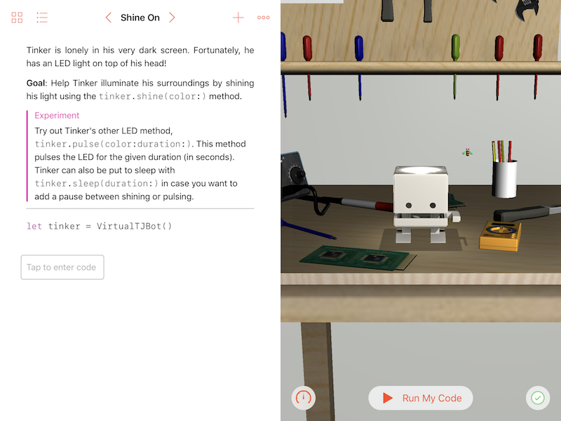

# tjbot-playground

> Swift Playground for interacting with TJBot! 🤖

Interact with [TJBot](http://ibm.biz/mytjbot) from your iPad in this Swift playground book! This project showcases how Swift can be used to interact with IoT devices such as TJBot. Learn how to program TJBot and make him come to life using IBM Watson services such as [Speech to Text](https://www.ibm.com/watson/developercloud/speech-to-text.html), [Visual Recognition](https://www.ibm.com/watson/developercloud/visual-recognition.html), [Language Translator](https://www.ibm.com/watson/developercloud/language-translator.html), and more!

The TJBot playground book communicates with your TJBot using Bluetooth Low Energy (BLE), so you can program your TJBot while sitting next to him!

> This playground book requires Swift Playgrounds 1.6. Please see [prior releases](https://github.com/jweisz/tjbot-playground/releases/) for a version that is compatible with earlier versions of Swift Playgrounds.

# Installation

The easiest way to get this playground on your iPad is to [download the latest release](https://github.com/jweisz/tjbot-playground/releases) to your Mac and then use AirDrop to copy the playground to your iPad. After downloading, right click the “TJBot.playgroundbook” file, and choose “Share > AirDrop.” A list will open up which should show your iPad. Click your iPad to transfer the Playground.

> Note: Make sure AirDrop on your iPad is turned on!

In addition to this playground book, you will need to install the [tjbot-daemon](https://github.com/jweisz/tjbot-daemon) project on your TJBot. Please refer to the [installation instructions](https://github.com/jweisz/tjbot-daemon/blob/master/README.md) to learn how to set up your TJBot with the daemon.

>  🤖 No robot, no problem! You can still explore the first two chapters of this playground without a physical TJBot.

# Usage

There are three chapters in the Playground.

1. **Tinker and Rebus** tells the story of Tinker the TJBot and his pal Rebus the Bee. Tinker is a virtual TJBot who lives in the screen of your iPad (physical TJBot not required!). Teach Tinker how to shine, wave, understand emotions, and translate languages in order to perform the Secret Dance of the TJBot and transform him into a real TJBot!
2. **Building TJBot** walks you through how to obtain your very own TJBot and set up its hardware and software.
3. **TJBot Explores the World** showcases the full functionality of your physical TJBot by listening, speaking, and seeing! Learn TJBot’s life story, tell him to change the color of his LED, ask him what he is looking at, and play a game of Rock Paper Scissors!

# Troubleshooting

#### Help, I need solutions!

If you are stuck on an example, we recommend referring to the hints before taking a peek at the solution guide.

If you would like to use this playground to demo TJBot's capabilities without having to write any code, please [download the solutions guide](https://github.com/jweisz/tjbot-playground/releases) and AirDrop the "TJBot (Solutions).playgroundbook" file to your iPad.

#### The playground doesn’t find my TJBot!

The TJBot playground communicates with the `tjbot-daemon` via Bluetooth LE (BLE). Please ensure the `tjbot-daemon` process is running on your TJBot to enable the playground book to connect to it.

#### My playground code stopped working!

It is possible that `tjbot-daemon` has crashed. Please take a look at the logs in the Terminal to troubleshoot. If you are stuck, [open an issue](https://github.com/jweisz/tjbot-playground/issues) and we will do our best to help.

#### I don’t see any images when calling `tj.see()` or `tj.read()`

Images have a lot of data, too much to transmit quickly over Bluetooth LE. Thus, in order for your iPad to load images from your TJBot, they both need to be on the same WiFi network.

> Note: The iPad will attempt to resolve your TJBot on the local network using its MDNS address. For example, if your TJBot is named “tinker”, then images are loaded from the base URL “http://tinker.local”. If your Wifi network (such as some Enterprise networks) drops MDNS packets, then you may not be able to load images from your TJBot. If you do not understand what MDNS is, don’t worry! Most home networking gear supports it. 😃

#### I'm trying to use a Watson service, but I'm not seeing anything happen.

It is possible that Watson is returning an error. Check the `error` property from any data returned from Watson. It is also possible that a typo in your Watson service credentials will cause Watson to not return data as expected.

#### I have another problem that isn’t listed here.

Please [open an issue](https://github.com/jweisz/tjbot-playground/issues) and we will do our best to address it.

# License
This project uses the [Apache License Version 2.0](LICENSE) software license.
